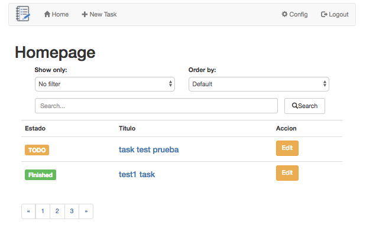

# Task Manager with Symfony & Angular

This is a FullStack App that combine a RESTFul API created in Symfony 3.3. In the client side, the data in managed by Angular 4, and use Bootstrap for layout.

The App contains a basic login system that allows to create and edit users, also to add, edit, display and remove tasks related to those users.

Looks like this:

In order to setup the app, please run this steps:

## Running the Backend:

1. Download this repo inside any Apache server instance in your computer: ... and be sure that your PHP version is >=5.5.9.
2. Inside the "db" folder you have the MySQL database dump. Create a local database and import the script in it.
3. Install Composer(in case you don't have it). Currently I'm using version 1.6.2.
4. Go to inside the "symfony" folder and run: `Composer update` - This will download all the dependencies.
5. Edit the `symfony/app/config/parameters.yml` with your local DB connection data.
6. Add privileges to your folder: "var/cache/" running: `chmod -R 777 var/cache/`
7. Now, you will have all the necessaries to run your backend, in my case the local url is like this: http://127.0.0.1/task_app/symfony/web/app_dev.php/login (but it depends from your Apache setup)

Those are the services available for you: 
(In order to test all of them, use postman is a good idea)

**Login - http://127.0.0.1/task_app/symfony/web/app_dev.php/login :: type POST  **
Body:
*key = json
value = {"email":"admin@admin.com","password":"admin"}
this will generate a token, that will be required for all the authorizations validations*

**New user - http://127.0.0.1/task_app/symfony/web/app_dev.php/user/new  :: type POST  **
Body:
*key = json | value = {"name":"admin55","surname":"admin55","email":"admin55@admin55.com","password":"admin55"}*

**Edit user - http://127.0.0.1/task_app/symfony/web/app_dev.php/user/edit  :: type POST  **
Body:
*key = json | value = {"name":"admin","surname":"admin","email":"admin@admin.com", "password":"admin"}
key = authorization | value = eyJ0eXAi... (token returned by login)*

**Task list - http://127.0.0.1/task_app/symfony/web/app_dev.php/task/list  :: type POST  **
Body:
*key = authorization | value = eyJ0eXAi... (token returned by login)*

**New Task - http://127.0.0.1/task_app/symfony/web/app_dev.php/task/new  :: type POST  **
Body:
*key = json | value = {"title":"title3","description":"description2","status":"new"}
key = authorization | value = eyJ0eXAi... (token returned by login)*

**Task Detail - http://127.0.0.1/task_app/symfony/web/app_dev.php/task/id/33  :: type POST  **
Body:
*key = authorization | value = eyJ0eXAi... (token returned by login)*

**Search Task - http://127.0.0.1/task_app/symfony/web/app_dev.php/task/search  :: type POST  **
Body:
*key = filter | value = 1 ( task type id = 1 = New, 2 = TODO, 3 = Finished)
key = order | value = 0 (0,1)
key = authorization | value = eyJ0eXAi... (token returned by login)*

**Task Remove - http://127.0.0.1/task_app/symfony/web/app_dev.php/task/remove/3  :: type POST  **
Body:
*key = authorization | value = eyJ0eXAi... (token returned by login)*

## Running the ClientSide

Be sure you have installed node(my version 9.0.0) and npm(my version 5.6.0)  

Go to your "Angular folder", and in the CLI type:

1. `npm install`
2. Go to your file: "angular/src/app/services/global.ts" and update to your API endpoint.
3. `npm start`
4. Check your http://localhost:4200/

